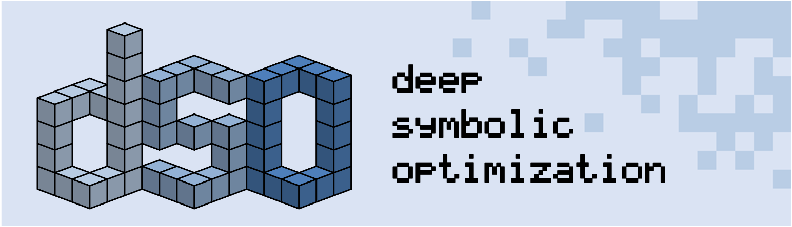

# Deep Symbolic Optimization Documentation

> Version: 1.0 • Last updated: 2025-07-07

<p align="center">

</p>

Welcome to the **Deep Symbolic Optimization (DSO)** documentation hub.
This site follows an industry-standard hierarchy that separates _guides_, _tutorials_, _reference_, and _design_ documents to serve both new users and core developers.

---

## Sections

| Section                     | Content                           |
| --------------------------- | --------------------------------- |
| [Guides](docs/guides)       | Installation, getting started     |
| [Rules](docs/rules)         | Code style, git policies, testing |
| [Structure](docs/structure) | Project layout and architecture   |
| [Tasks](docs/tasks)         | Development plans and roadmaps    |

---

## Navigation

```bash
/docs
├── README.md                # You are here
├── overview.md              # Product summary & scope
├── guides/                  # User & operator guides
├── rules/                   # Release & maintenance docs
├── structure/               # Policies (coding, git, docs…)
└── tasks/                   # Governance, security, conduct
```

Each sub-directory contains its own `README.md` to aid discoverability (except where a single document suffices).

---

## Building Docs Locally

```bash
cd dso-docs
pnpm start  # Live-reload at http://localhost:3000/
```

If Doccusaurus isn't installed yet, run:

```bash
cd dso-docs
pnpm build docusaurus
```
