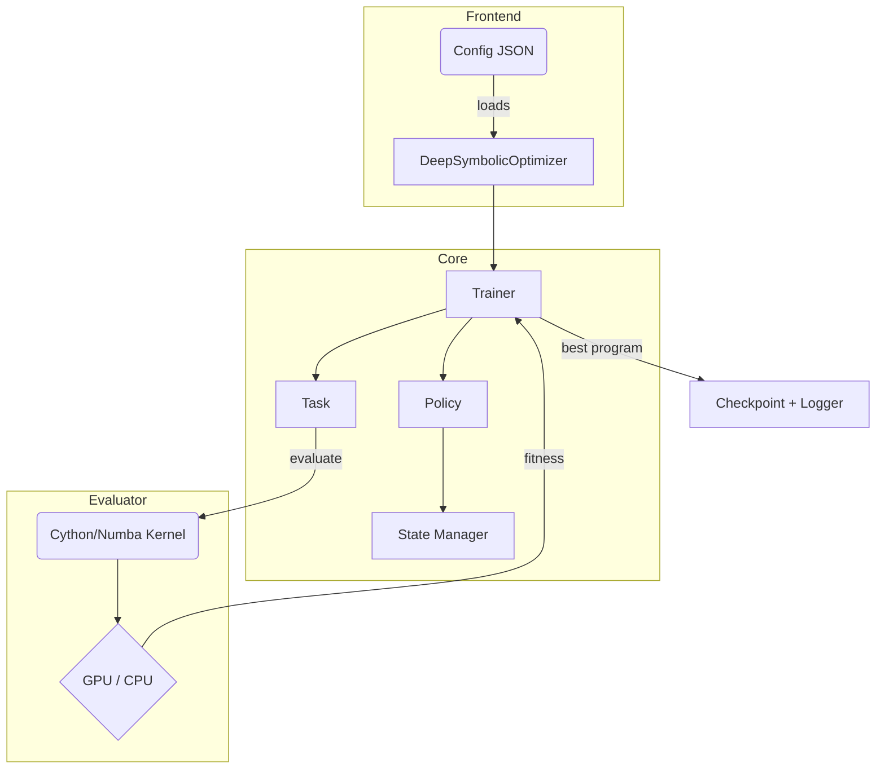

# Architecture Overview

> Version: 1.0 • Last updated: 2025-07-07

This document provides a high-level view of major DSO components and their interactions.

## Component Descriptions

| ID  | Component             | Responsibility                               |
| --- | --------------------- | -------------------------------------------- |
| A   | Config JSON           | Declarative run configuration                |
| B   | DeepSymbolicOptimizer | Orchestrates setup and training              |
| C   | Trainer               | Implements RL loop & GP meld logic           |
| D   | Policy                | Neural agent proposing expression edits      |
| E   | Task                  | Regression or control objective              |
| F   | State Manager         | Handles RNN hidden states or transformer mem |
| G   | Evaluation Kernel     | Fast parallel fitness computation            |
| I   | Checkpoint + Logger   | Persist artifacts & metrics for analysis     |

## Data Flow

1. **Initialisation** – JSON config is parsed; components are built.
2. **Sampling** – Policy generates program candidates.
3. **Evaluation** – Candidates are scored by the Task/Evaluator.
4. **Update** – Trainer computes gradients / GP updates.
5. **Checkpoint** – Best program & metrics saved periodically.

## ADRs

Design decisions are tracked in the [ADR directory](adr/ADR-0000-template.md) where each decision record lives.

See [`ADR Template`](adr/ADR-0000-template.md) for the decision record format.
