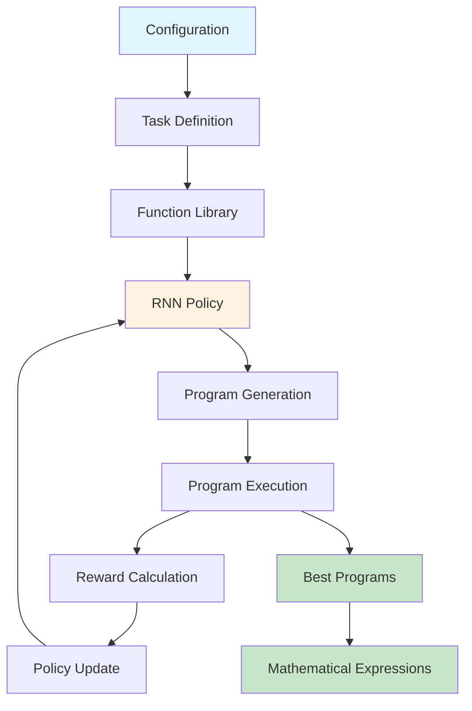
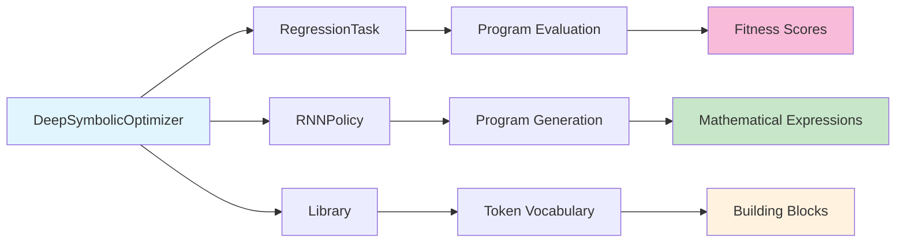

# DSO Architecture & Core Concepts

> Version: 1.0 • Last updated: 2025-09-01

This document explains the fundamental architecture and concepts of the Deep Symbolic Optimization framework.

## 🏗️ **Core Architecture**

DSO consists of four main components that work together to discover mathematical expressions:



### **Component Interactions**



### **Main Components**

- **`DeepSymbolicOptimizer`** → Main orchestrator that coordinates all components
- **`RegressionTask`** → Problem definition and evaluation framework
- **`RNNPolicy`** → Neural network that generates mathematical expressions
- **`Program`** → Represents and executes mathematical expressions
- **`Library`** → Collection of available mathematical operations (tokens)

## 🧩 **Tokens - The Building Blocks**

Tokens are the fundamental mathematical building blocks that DSO uses to construct expressions.

### **What are Tokens?**
- Basic mathematical operations, variables, and constants
- Like LEGO pieces that combine to form complete mathematical expressions
- Each token has properties: `arity` (number of inputs), `complexity`, `function`

### **Types of Tokens**

#### **Binary Operators** (arity=2)
```python
add → x + y
sub → x - y  
mul → x * y
div → x / y
```

#### **Unary Operators** (arity=1)
```python
sin → sin(x)
cos → cos(x)
exp → e^x
log → ln(x)
sqrt → √x
neg → -x
```

#### **Input Variables**
```python
x1, x2, x3 → input features from your dataset
```

#### **Constants**
```python
const → learnable constants (optimized during training)
1.0, 2.5 → hard-coded numerical values
```

## 🌳 **Expression Representation**

### **Tree Structure**
Mathematical expressions are represented as binary trees in prefix notation:

```
Expression: (x1 * x2) + sin(x3)
Tokens: [add, mul, x1, x2, sin, x3]
Tree:
    add
   /   \
  mul   sin
 / \     |
x1  x2   x3
```

### **Token Sequence Generation**
- RNN generates tokens one by one: `[add, mul, x1, x2, sin, x3]`
- Each token depends on previous tokens and current tree state
- Generation stops when expression is mathematically complete

### **Execution Process**
Tokens are processed using a stack-based approach:
1. Push operators and operands onto stack
2. When operator has all required inputs, execute and push result
3. Final result is the expression output

## 📊 **Dimensionality & Data Flow**

### **Current MISO (Multiple Input Single Output)**
```
Input Data: X [n_samples, n_features]
Example: [[0.5, 0.3, 0.8], [0.1, 0.9, 0.2], ...]

Expression: sin(x1) + x2*x3

Output: y [n_samples]  
Example: [0.847, 1.234, ...]
```

### **Tensor Operations**
- All operations are vectorized using NumPy
- `execute()` processes entire datasets simultaneously
- Efficient GPU acceleration through Cython

## 🎯 **Policy & Training**

### **RNN Policy Network**
- **Input**: Current expression state and available tokens
- **Output**: Probability distribution over next token
- **Training**: Reinforcement learning using REINFORCE algorithm

### **Training Loop**
1. **Sample**: Generate batch of expressions using current policy
2. **Evaluate**: Execute expressions on training data, compute rewards
3. **Update**: Adjust policy to favor high-reward expressions
4. **Repeat**: Continue until convergence

### **Reward System**
```python
# Execute expression on training data
y_pred = expression.execute(X_train)

# Compute fitness score
reward = metric(y_true, y_pred)  # e.g., inv_nrmse, pearson correlation

# Higher reward = better expression
```

## 🔒 **Constraints & Priors**

### **Purpose**
- Guide search toward meaningful expressions
- Prevent invalid or nonsensical formulas
- Incorporate domain knowledge

### **Constraint Types**

#### **Structural Constraints**
- `max_length` → Limit expression complexity
- `arity` → Each operator has fixed number of inputs

#### **Mathematical Constraints**
- `protected` mode → Prevent division by zero, log of negative numbers
- `threshold` → Early stopping criteria

#### **Domain-Specific Constraints**
- `repeat` → Limit repeated use of same operator
- `trig` → Control trigonometric function usage
- `relational` → Control parent-child relationships in expression tree

## 📚 **Library System**

### **Token Library**
The Library contains all available mathematical operations with their properties:

```python
Library([
    Token(np.add, "add", arity=2, complexity=1),
    Token(np.sin, "sin", arity=1, complexity=3),
    Token(None, "x1", arity=0, input_var=0),  # Input variable
    PlaceholderConstant()  # Learnable constant
])
```

### **Function Sets**
Predefined collections of operators for different domains:
- **Basic**: `["add", "sub", "mul", "div"]`
- **Trigonometric**: `["sin", "cos", "tan"]`
- **Scientific**: `["exp", "log", "sqrt", "pow"]`

## 🏆 **Evaluation Metrics**

### **Regression Metrics**
- `inv_nrmse` → 1/(1 + normalized_rmse) - higher is better
- `neg_mse` → -mean_squared_error
- `pearson` → Pearson correlation coefficient
- `spearman` → Spearman rank correlation

### **Evaluation Process**
```python
def reward_function(program):
    # Execute program on training data
    y_hat = program.execute(X_train)
    
    # Handle invalid expressions
    if program.invalid:
        return invalid_reward
    
    # Compute metric
    reward = metric(y_train, y_hat)
    return reward
```

## 🔄 **Program Lifecycle**

1. **Generation**: Policy samples token sequence
2. **Construction**: Tokens assembled into Program object
3. **Validation**: Check for mathematical validity
4. **Execution**: Evaluate on training data
5. **Optimization**: Optimize constants if present
6. **Evaluation**: Compute reward/fitness score
7. **Feedback**: Update policy based on performance

## 🚀 **Advanced Features**

### **Constant Optimization**
- Placeholder constants (`const` tokens) are optimized using gradient descent
- Finds optimal numerical values within discovered symbolic structure

### **Protected Operations**
- Safe versions of mathematical operations prevent numerical errors
- `protected_div` avoids division by zero
- `protected_log` handles negative inputs

### **Parallel Evaluation**
- Multiple expressions evaluated simultaneously
- GPU acceleration for large datasets
- Efficient memory management

This architecture enables DSO to efficiently explore the space of mathematical expressions while maintaining interpretability and performance.
