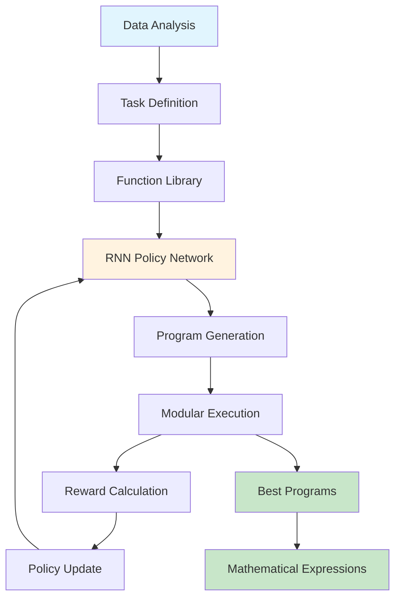
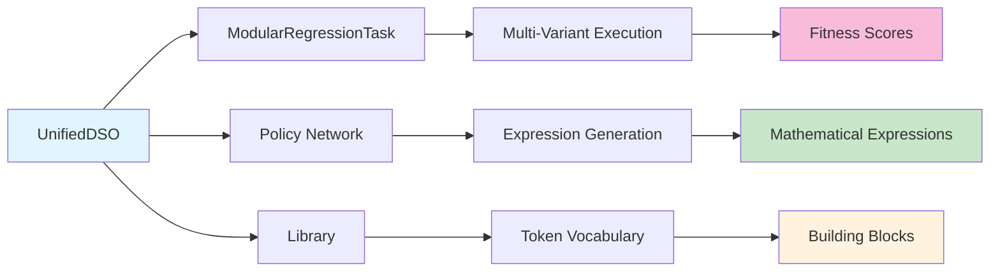

# DSO Architecture & Core Concepts

> Version: 2.0 • Last updated: 2025-09-15

This document explains the fundamental architecture and concepts of the Deep Symbolic Optimization framework, featuring our **modular architecture** with automatic data variant detection and multi-output regression (MIMO) capabilities.

## 🏗️ **Core Architecture**

DSO consists of four main components that work together to discover mathematical expressions with automatic data variant detection:



### **Component Interactions**



## 🧩 **Modular Architecture Benefits**

### **Modern Design Principles**

DSO's modular architecture provides significant improvements over monolithic approaches:

```python
# Automatic Data Variant Detection (data_types.py)
def auto_detect_data_structure(X, y):
    """Automatically detect data variant and configure execution"""
    
    # Analyze input/output dimensions
    data_shape = DataShape(X, y)
    variant = data_shape.variant  # SISO/MISO/SIMO/MIMO
    
    # Configure appropriate execution path
    if variant == DataVariant.VECTOR_BOTH:  # MIMO
        return configure_mimo_execution(data_shape)
    elif variant == DataVariant.VECTOR_INPUT:  # MISO
        return configure_miso_execution(data_shape)
    else:
        return configure_default_execution(data_shape)
```

### **Key Architectural Components**

#### **1. Unified DSO Interface**
```python
class UnifiedDSO:
    """Main entry point with automatic variant detection"""
    
    def fit(self, dataset):
        # Step 1: Create modular task (handles data analysis)
        self.task = ModularRegressionTask(dataset=dataset)
        
        # Step 2: Extract data shape and configure execution
        self.data_shape = self.task.data_shape
        variant = self.data_shape.variant  # Automatic detection
        
        # Step 3: Configure appropriate components
        self.policy = create_modular_policy(variant)
        self.program_class = create_program_for_variant(variant)
        
        # Step 4: Train with variant-specific optimizations
        return self.train()
```

#### **2. Modular Data Handling**
```python
class DataShape:
    """Automatic data structure analysis"""
    
    def __init__(self, X, y):
        self.X, self.y = X, y
        self.variant = self._detect_variant()  # Auto-detect SISO/MISO/SIMO/MIMO
        self.input_dims = self._extract_input_dims()
        self.output_dims = self._extract_output_dims()
        
        # Convenience flags for different execution paths
        self.is_mimo = self.variant == DataVariant.VECTOR_BOTH
        self.n_inputs = self.input_dims['n_features']
        self.n_outputs = self.output_dims['n_outputs']
```

#### **3. Variant-Specific Program Execution**
```python
class ModularProgram:
    """Program with automatic execution variant selection"""
    
    def execute(self, X):
        """Execute with appropriate variant handler"""
        if self.executor is None:
            self._configure_executor()  # Auto-configure based on data shape
            
        return self.executor.execute(self, X)
    
    def _configure_executor(self):
        """Select executor based on data variant"""
        if self.data_shape.variant == DataVariant.VECTOR_BOTH:
            self.executor = MultiOutputExecutor(self.data_shape.n_outputs)
        elif self.data_shape.variant == DataVariant.VECTOR_INPUT:
            self.executor = VectorExecutor()
        else:
            self.executor = ScalarExecutor()
```

### **Architecture Benefits**

| Feature | Traditional DSO | Modular DSO | Improvement |
|---------|----------------|-------------|-------------|
| **Data Support** | MISO only | SISO/MISO/SIMO/MIMO | Universal coverage |
| **Configuration** | Manual setup | Auto-detection | Zero configuration |
| **Extensibility** | Monolithic | Modular components | Easy customization |
| **Multi-Output** | Not supported | Native MIMO | Multiple expressions |
| **Execution** | Single path | Variant-optimized | Performance matched to data |

### **Main Components**

- **`UnifiedDSO`** → Main entry point with automatic variant detection
- **`ModularRegressionTask`** → Data analysis and variant configuration
- **`ModularProgram`** → Expressions with variant-specific execution
- **`MultiProgram`** → Container for multi-output expression sets
- **`DataShape`** → Automatic data structure analysis and configuration

## 🧩 **Tokens - The Building Blocks**

Tokens are the fundamental mathematical building blocks that DSO uses to construct expressions.

### **What are Tokens?**
- Basic mathematical operations, variables, and constants
- Like LEGO pieces that combine to form complete mathematical expressions
- Each token has properties: `arity` (number of inputs), `complexity`, `function`

### **Types of Tokens**

#### **Binary Operators** (arity=2)
```python
add → x + y
sub → x - y  
mul → x * y
div → x / y
```

#### **Unary Operators** (arity=1)
```python
sin → sin(x)
cos → cos(x)
exp → e^x
log → ln(x)
sqrt → √x
neg → -x
```

#### **Input Variables**
```python
x1, x2, x3 → input features from your dataset
```

#### **Constants**
```python
const → learnable constants (optimized during training)
1.0, 2.5 → hard-coded numerical values
```

## 🌳 **Expression Representation**

### **Tree Structure**
Mathematical expressions are represented as binary trees in prefix notation:

```
Expression: (x1 * x2) + sin(x3)
Tokens: [add, mul, x1, x2, sin, x3]
Tree:
    add
   /   \
  mul   sin
 / \     |
x1  x2   x3
```

### **Token Sequence Generation**
- RNN generates tokens one by one: `[add, mul, x1, x2, sin, x3]`
- Each token depends on previous tokens and current tree state
- Generation stops when expression is mathematically complete

### **Execution Process**
Tokens are processed using a stack-based approach:
1. Push operators and operands onto stack
2. When operator has all required inputs, execute and push result
3. Final result is the expression output

## 📊 **Data Variant Support & Flow**

### **SISO (Single Input Single Output)**
```
Input: X [n_samples, 1] - Single feature
Output: y [n_samples] - Single target
Example: f(x) = x^2 + 1
```

### **MISO (Multiple Input Single Output)**
```
Input: X [n_samples, n_features] - Multiple features
Output: y [n_samples] - Single target
Example: f(x1,x2,x3) = sin(x1) + x2*x3
```

### **SIMO (Single Input Multiple Output)**
```
Input: X [n_samples, 1] - Single feature
Output: y [n_samples, n_outputs] - Multiple targets
Example: [f1(x), f2(x), f3(x)] = [x^2, sin(x), exp(x)]
```

### **MIMO (Multiple Input Multiple Output)**
```
Input: X [n_samples, n_features] - Multiple features
Output: y [n_samples, n_outputs] - Multiple targets
Example: [f1(x1,x2), f2(x1,x2)] = [x1*x2, sin(x1)+x2]
```

### **Execution Operations**
- All operations vectorized using NumPy with Cython acceleration
- `execute()` processes entire datasets simultaneously
- Variant-specific optimizations for different data structures

## 🎯 **Policy & Training**

### **RNN Policy Network**
- **Input**: Current expression state and available tokens
- **Output**: Probability distribution over next token
- **Training**: Reinforcement learning using REINFORCE algorithm

### **Training Loop**
1. **Sample**: Generate batch of expressions using current policy
2. **Evaluate**: Execute expressions on training data, compute rewards
3. **Update**: Adjust policy to favor high-reward expressions
4. **Repeat**: Continue until convergence

### **Reward System**
```python
# Execute expression on training data
y_pred = expression.execute(X_train)

# Compute fitness score
reward = metric(y_true, y_pred)  # e.g., inv_nrmse, pearson correlation

# Higher reward = better expression
```

## 🔒 **Constraints & Priors**

### **Purpose**
- Guide search toward meaningful expressions
- Prevent invalid or nonsensical formulas
- Incorporate domain knowledge

### **Constraint Types**

#### **Structural Constraints**
- `max_length` → Limit expression complexity
- `arity` → Each operator has fixed number of inputs

#### **Mathematical Constraints**
- `protected` mode → Prevent division by zero, log of negative numbers
- `threshold` → Early stopping criteria

#### **Domain-Specific Constraints**
- `repeat` → Limit repeated use of same operator
- `trig` → Control trigonometric function usage
- `relational` → Control parent-child relationships in expression tree

## 📚 **Library System**

### **Token Library**
The Library contains all available mathematical operations with their properties:

```python
Library([
    Token(np.add, "add", arity=2, complexity=1),
    Token(np.sin, "sin", arity=1, complexity=3),
    Token(None, "x1", arity=0, input_var=0),  # Input variable
    PlaceholderConstant()  # Learnable constant
])
```

### **Function Sets**
Predefined collections of operators for different domains:
- **Basic**: `["add", "sub", "mul", "div"]`
- **Trigonometric**: `["sin", "cos", "tan"]`
- **Scientific**: `["exp", "log", "sqrt", "pow"]`

## 🏆 **Evaluation Metrics**

### **Regression Metrics**
- `inv_nrmse` → 1/(1 + normalized_rmse) - higher is better
- `neg_mse` → -mean_squared_error
- `pearson` → Pearson correlation coefficient
- `spearman` → Spearman rank correlation

### **Evaluation Process**
```python
def reward_function(program):
    # Execute program on training data
    y_hat = program.execute(X_train)
    
    # Handle invalid expressions
    if program.invalid:
        return invalid_reward
    
    # Compute metric
    reward = metric(y_train, y_hat)
    return reward
```

## 🔄 **Program Lifecycle**

1. **Generation**: Policy samples token sequence
2. **Construction**: Tokens assembled into Program object
3. **Validation**: Check for mathematical validity
4. **Execution**: Evaluate on training data
5. **Optimization**: Optimize constants if present
6. **Evaluation**: Compute reward/fitness score
7. **Feedback**: Update policy based on performance

## 🚀 **Advanced Features**

### **Constant Optimization**
- Placeholder constants (`const` tokens) are optimized using gradient descent
- Finds optimal numerical values within discovered symbolic structure

### **Protected Operations**
- Safe versions of mathematical operations prevent numerical errors
- `protected_div` avoids division by zero
- `protected_log` handles negative inputs

### **Parallel Evaluation**
- Multiple expressions evaluated simultaneously
- GPU acceleration for large datasets
- Efficient memory management

## 🔄 **Multi-Output Program Architecture**

### **MIMO Expression Handling**

For multi-output problems, DSO can use different strategies:

#### **Independent Expressions (Current Implementation)**
```python
# Each output has its own expression
expressions = [
    "x1 * x2",      # Output 1
    "sin(x1)",      # Output 2  
    "x1 + x2"       # Output 3
]
```

#### **Multi-Program Container**
```python
class MultiProgram:
    """Container for multiple expressions in MIMO"""
    
    def __init__(self, programs):
        self.programs = programs  # List of Program objects
        
    def execute(self, X):
        """Execute all programs and stack outputs"""
        outputs = []
        for program in self.programs:
            output = program.execute(X)
            outputs.append(output)
        return np.column_stack(outputs)
```

### **Future Extensions**

The modular architecture enables future extensions:
- **Shared sub-expressions**: Common terms across outputs
- **Hierarchical expressions**: Nested expression dependencies  
- **Tensor operations**: Higher-dimensional data support
- **Symbolic constraints**: Physical law enforcement

This modular architecture enables DSO to efficiently explore the space of mathematical expressions across diverse data structures while maintaining interpretability and performance.
