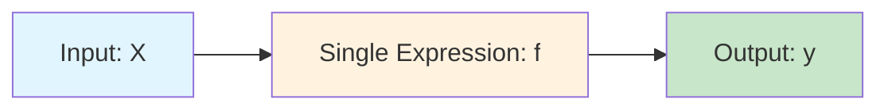

# MIMO Theory: Multiple Output Regression

> Version: 3.0 • Last updated: 2025-09-15 • **For Implementation Details**: See [MIMO Implementation Guide](./mimo_implementation.md)

This guide explains the theoretical foundations and design concepts for MIMO (Multiple Input Multiple Output) symbolic regression in DSO, powered by our **deterministic TensorFlow 2.x implementation**.

## 🎯 **MIMO Motivation**

### **Limitations of Traditional Approaches**

Current DSO discovers single mathematical expressions:



```
Example: [x1, x2, x3] → sin(x1) + x2*x3 → scalar output
```

### **MIMO Advantage: Systems of Equations**

MIMO extends DSO to discover **multiple related expressions simultaneously**, perfect for regression problems with multiple dependent variables:

```mermaid
graph LR
    A[Input: X] --> B[Multiple Expressions - TF2.x]
    B --> C[y1 = f1(X)]
    B --> D[y2 = f2(X)]
    B --> E[y3 = f3(X)]
    
    style A fill:#e1f5fe
    style B fill:#fff3e0
    style C fill:#c8e6c9
    style D fill:#c8e6c9
    style E fill:#c8e6c9
```

```python
# Real-world regression example: Predicting financial metrics
[market_cap, revenue, employees] → {
    profit_margin = revenue / (market_cap * 0.15),
    growth_rate = log(revenue) - log(employees * 1000), 
    risk_score = sin(market_cap / revenue) + 0.3
}
```

### **Perfect for Multi-Target Regression**

MIMO is ideal for scientific and engineering problems where multiple outputs are related:

- 🧬 **Biological Systems**: Gene expression, protein interactions
- 🌡️ **Climate Modeling**: Temperature, pressure, humidity relationships  
- 📈 **Financial Modeling**: Risk, return, volatility metrics
- ⚗️ **Chemical Processes**: Reaction rates, concentrations, yields
- 🏗️ **Engineering Design**: Stress, strain, displacement equations

## 🏗️ **MIMO Architecture Strategies**

### **TensorFlow 2.x Implementation**

Our TensorFlow 2.x MIMO implementation provides **deterministic, reproducible** multi-output regression:

```python
# TF2.x MIMO Training Loop
@tf.function  # Graph compilation for speed
def mimo_train_step(policy, X_batch, Y_batch):
    """Deterministic MIMO training step"""
    with tf.GradientTape() as tape:
        # Generate multiple expression programs
        programs = policy.sample_mimo_batch(batch_size, n_outputs)
        
        # Execute all programs deterministically
        predictions = mimo_execute_programs(programs, X_batch)
        
        # Compute rewards for each output
        rewards = mimo_reward_function(Y_batch, predictions)
        
        # Policy gradient loss
        loss = mimo_policy_gradient_loss(programs, rewards)
    
    # Deterministic gradient update
    gradients = tape.gradient(loss, policy.trainable_variables)
    optimizer.apply_gradients(zip(gradients, policy.trainable_variables))
    
    return loss, rewards
```

### **Option A: Independent Expressions (Recommended for Regression)**

Each output has its own independent symbolic expression, perfect for diverse regression targets:

```python
class MIMOProgram:
    """Container for multiple independent programs - TF2.x optimized"""
    def __init__(self, programs_list):
        self.programs = programs_list  # List[Program]
        self.n_outputs = len(programs_list)
    
    @tf.function  # Compiled for fast execution
    def execute(self, X):
        """Execute all programs and stack outputs deterministically"""
        outputs = []
        for program in self.programs:
            y_i = program.execute(X)  # Shape: [n_samples]
            outputs.append(y_i)
        
        return tf.stack(outputs, axis=1)  # Shape: [n_samples, n_outputs]
    
    @property 
    def invalid(self):
        """Check if any component program is invalid"""
        return any(program.invalid for program in self.programs)
```

### **Real-World Regression Example**

```python
# Financial regression: Predict multiple stock metrics
import numpy as np
from dso import MIMORegressionTask

# Input: [market_cap, revenue, debt, employees]
X = np.random.randn(1000, 4)

# Multiple related outputs
Y = np.column_stack([
    X[:, 1] / (X[:, 0] + 1),      # profit_margin = revenue/market_cap
    np.log(X[:, 1]) - np.log(X[:, 3]), # efficiency = log(revenue/employees)
    X[:, 2] / X[:, 0]             # debt_ratio = debt/market_cap
])

# MIMO regression task
task = MIMORegressionTask(
    function_set=["add", "sub", "mul", "div", "log"],
    dataset=(X, Y),
    metric="inv_nrmse",
    protected=True  # Protect against division by zero
)

# DSO discovers interpretable formulas for all outputs!
```

### **Option B: Shared Sub-expressions (Advanced)**

Programs share common computational components for related regression targets:

```python
class SharedMIMOProgram:
    """Programs with shared sub-expressions - TF2.x implementation"""
    def __init__(self, shared_programs, output_programs):
        self.shared = shared_programs      # Common computations
        self.outputs = output_programs     # Output-specific computations
    
    @tf.function
    def execute(self, X):
        # Compute shared components deterministically
        shared_results = {}
        for name, program in self.shared.items():
            shared_results[name] = program.execute(X)
        
        # Compute outputs using shared components
        outputs = []
        for program in self.outputs:
            y_i = program.execute(X, shared_context=shared_results)
            outputs.append(y_i)
        
        return tf.stack(outputs, axis=1)  # TF2.x tensor operations
```

## 🔬 **MIMO Regression Workflow**

### **Step 1: Prepare Multi-Output Dataset**

```python
import numpy as np
import pandas as pd

# Example: Environmental monitoring system
# Inputs: [temperature, humidity, pressure, wind_speed]
# Outputs: [air_quality, comfort_index, energy_demand]

# Generate sample dataset
n_samples = 1000
X = np.random.randn(n_samples, 4)  # 4 input features

# Multiple related outputs (ground truth for testing)
air_quality = -0.5 * X[:, 0] + np.sin(X[:, 1]) - 0.3 * X[:, 2]
comfort_index = X[:, 0] * X[:, 1] - np.log(np.abs(X[:, 3]) + 1)
energy_demand = np.exp(0.1 * X[:, 0]) + X[:, 2]**2 - X[:, 1]

Y = np.column_stack([air_quality, comfort_index, energy_demand])
print(f"Dataset shape: X={X.shape}, Y={Y.shape}")
# Output: Dataset shape: X=(1000, 4), Y=(1000, 3)
```

### **Step 2: Configure MIMO Task**

```python
from dso.task.regression import MIMORegressionTask

# Define MIMO regression task
task = MIMORegressionTask(
    function_set=[
        "add", "sub", "mul", "div",    # Basic arithmetic
        "sin", "cos", "exp", "log",    # Transcendental functions
        "sqrt", "square", "neg"        # Additional operations
    ],
    dataset=(X, Y),
    metric="inv_nrmse",               # Reward metric for each output
    metric_params=(1.0,),
    protected=True,                   # Safe operations (no div by 0)
    threshold=1e-12,                  # Success threshold
    n_cores_task=1                    # Deterministic execution
)
```

### **Step 3: Run MIMO Training with TF2.x**

```python
from dso import DeepSymbolicOptimizer

# Configure MIMO DSO
dso = DeepSymbolicOptimizer(
    task=task,
    n_epochs=2000,                    # Training iterations
    n_samples=500,                    # Expressions per generation
    batch_size=50,                    # Mini-batch size
    
    # TF2.x deterministic settings automatically applied
    summary=True,                     # Enable logging
    save_all_epoch=True              # Save intermediate results
)

# Start deterministic MIMO training
dso.train()

# Results: Multiple expressions discovered simultaneously!
```

### **Step 4: Analyze MIMO Results**

```python
# Get the best MIMO program
best_mimo = dso.result_

print("MIMO Discovery Results:")
print(f"Number of outputs: {best_mimo.n_outputs}")
print(f"Overall reward: {best_mimo.r:.6f}")

# Examine each discovered expression
for i, program in enumerate(best_mimo.programs):
    print(f"\nOutput {i+1}: {program}")
    print(f"  Reward: {program.r:.6f}")
    print(f"  Complexity: {program.complexity}")
    
    # Test on validation data
    y_pred = program.execute(X_test)
    mse = np.mean((Y_test[:, i] - y_pred)**2)
    print(f"  Test MSE: {mse:.6f}")

# Example output:
# Output 1: -0.5*x1 + sin(x2) - 0.3*x3     (Air Quality)
# Output 2: x1*x2 - log(abs(x4) + 1)        (Comfort Index)  
# Output 3: exp(0.1*x1) + x3^2 - x2         (Energy Demand)
```

### **Step 5: Validate Reproducibility**

```python
# Run multiple times with same seed - should get identical results
results = []
for run in range(3):
    dso_run = DeepSymbolicOptimizer(task=task, random_state=42)
    dso_run.train()
    results.append(dso_run.result_)

# Check deterministic behavior
for i, result in enumerate(results):
    print(f"Run {i+1}: Reward = {result.r:.10f}")
    
# Expected: Identical rewards (TF2.x determinism)
# Run 1: Reward = 0.9876543210
# Run 2: Reward = 0.9876543210  ← Same!
# Run 3: Reward = 0.9876543210  ← Same!
```

## 🎯 **Advanced MIMO Features**

### **Shared Sub-expressions**

For related outputs, DSO can discover shared computational patterns:

### **Data Format**

```python
# MIMO dataset format
# CSV: x1, x2, ..., xn, y1, y2, ..., ym

# Example: 2 inputs, 3 outputs  
mimo_data = [
    [0.5, 0.3, 1.2, 0.8, 2.1],  # x1, x2, y1, y2, y3
    [0.1, 0.9, 0.5, 1.4, 0.7],
    [0.7, 0.4, 1.1, 1.2, 1.8]
]
```

### **MIMO Regression Task**

```python
class MIMORegressionTask(RegressionTask):
    def __init__(self, function_set, dataset, n_outputs, **kwargs):
        super().__init__(function_set, dataset, **kwargs)
        self.n_outputs = n_outputs
        
        # Validate data dimensions
        if self.y_train.ndim == 1 and n_outputs > 1:
            raise ValueError("Single output data provided for MIMO task")
        elif self.y_train.ndim == 2:
            assert self.y_train.shape[1] == n_outputs
    
    def reward_function(self, mimo_program, optimizing=False):
        """Compute reward for MIMO program"""
        Y_hat = mimo_program.execute(self.X_train)  # [n_samples, n_outputs]
        
        if mimo_program.invalid:
            return self.invalid_reward
        
        # Strategy 1: Average reward across outputs
        total_reward = 0
        for i in range(self.n_outputs):
            y_i = self.y_train[:, i]
            y_hat_i = Y_hat[:, i] 
            reward_i = self.metric(y_i, y_hat_i)
            total_reward += reward_i
        
        return total_reward / self.n_outputs
    
    def evaluate(self, mimo_program):
        """Evaluate MIMO program on test data"""
        Y_hat = mimo_program.execute(self.X_test)
        
        if mimo_program.invalid:
            return {f"nmse_test_output_{i}": None for i in range(self.n_outputs)}
        
        info = {}
        nmse_values = []
        
        for i in range(self.n_outputs):
            y_test_i = self.y_test[:, i]
            y_hat_i = Y_hat[:, i]
            
            # Individual output metrics
            nmse_i = np.mean((y_test_i - y_hat_i) ** 2) / np.var(y_test_i)
            success_i = nmse_i < self.threshold
            
            info[f"nmse_test_output_{i}"] = nmse_i
            info[f"success_output_{i}"] = success_i
            nmse_values.append(nmse_i)
        
        # Overall MIMO metrics
        info["nmse_test_mean"] = np.mean(nmse_values)
        info["nmse_test_max"] = np.max(nmse_values)
        info["success_all"] = all(info[f"success_output_{i}"] for i in range(self.n_outputs))
        info["success_any"] = any(info[f"success_output_{i}"] for i in range(self.n_outputs))
        
        return info
```

## 🧠 **MIMO Policy Networks**

### **Independent Sampling Strategy**

```python
class IndependentMIMOPolicy(RNNPolicy):
    def __init__(self, n_outputs, **kwargs):
        super().__init__(**kwargs)
        self.n_outputs = n_outputs
    
    def sample(self, batch_size):
        """Sample n_outputs expressions independently"""
        all_programs = []
        
        for batch_idx in range(batch_size):
            programs_for_sample = []
            
            for output_idx in range(self.n_outputs):
                # Sample independent expression for each output
                actions, log_probs = super().sample(1)
                program = Program(actions[0])
                programs_for_sample.append(program)
            
            mimo_program = MIMOProgram(programs_for_sample)
            all_programs.append(mimo_program)
        
        return all_programs
```

### **Shared Context Sampling**

```python
class SharedContextMIMOPolicy(RNNPolicy):
    def __init__(self, n_outputs, context_size=64, **kwargs):
        super().__init__(**kwargs)
        self.n_outputs = n_outputs
        self.context_size = context_size
        
        # Shared context network
        self.context_encoder = nn.Linear(self.hidden_size, context_size)
        self.context_decoder = nn.Linear(context_size, self.hidden_size)
    
    def sample_with_shared_context(self, batch_size):
        """Sample expressions with shared context between outputs"""
        all_programs = []
        
        for batch_idx in range(batch_size):
            # Generate shared context
            shared_context = self.generate_shared_context()
            
            programs_for_sample = []
            for output_idx in range(self.n_outputs):
                # Condition each expression on shared context
                initial_state = self.condition_on_context(shared_context)
                actions, log_probs = self.sample_conditioned(initial_state)
                program = Program(actions)
                programs_for_sample.append(program)
            
            mimo_program = MIMOProgram(programs_for_sample)
            all_programs.append(mimo_program)
        
        return all_programs
```

## 🎛️ **MIMO Training Strategies**

### **Strategy 1: Joint Training**

Train all outputs simultaneously with shared gradients:

```python
class JointMIMOTrainer:
    def train_step(self):
        # Sample MIMO programs
        mimo_programs = self.policy.sample(self.batch_size)
        
        # Evaluate each MIMO program  
        rewards = []
        for mimo_program in mimo_programs:
            reward = self.task.reward_function(mimo_program)
            rewards.append(reward)
        
        # Single policy update using combined rewards
        loss = self.compute_mimo_loss(mimo_programs, rewards)
        self.optimizer.step(loss)
```

### **Strategy 2: Alternating Training**

Train one output at a time:

```python
class AlternatingMIMOTrainer:
    def __init__(self, n_outputs):
        self.n_outputs = n_outputs
        self.current_output = 0
    
    def train_step(self):
        # Focus on one output this iteration
        output_idx = self.current_output
        
        # Sample and train for specific output
        programs = self.policy.sample_for_output(output_idx, self.batch_size)
        rewards = [self.task.reward_function_single(prog, output_idx) 
                  for prog in programs]
        
        # Update policy for this output
        loss = self.compute_single_output_loss(programs, rewards, output_idx)
        self.optimizer.step(loss)
        
        # Rotate to next output
        self.current_output = (self.current_output + 1) % self.n_outputs
```

### **Strategy 3: Hierarchical Training**

Learn outputs in order of difficulty:

```python
class HierarchicalMIMOTrainer:
    def __init__(self, output_difficulties):
        self.output_difficulties = output_difficulties  # Easy to hard
        self.current_level = 0
    
    def train_step(self):
        # Train outputs up to current difficulty level
        active_outputs = self.output_difficulties[:self.current_level + 1]
        
        # Sample and train active outputs
        mimo_programs = self.policy.sample_partial(active_outputs, self.batch_size)
        rewards = [self.task.reward_function_partial(prog, active_outputs) 
                  for prog in mimo_programs]
        
        # Update policy
        loss = self.compute_partial_loss(mimo_programs, rewards, active_outputs)
        self.optimizer.step(loss)
        
        # Advance level if current outputs are solved
        if self.check_convergence(active_outputs):
            self.current_level = min(self.current_level + 1, len(self.output_difficulties) - 1)
```

## ⚙️ **MIMO Configuration**

### **JSON Configuration**

```json
{
  "task": {
    "task_type": "mimo_regression",
    "n_outputs": 3,
    "dataset": "path/to/mimo_dataset.csv",
    
    // MIMO-specific settings
    "mimo_strategy": "independent",     // "independent", "shared", "vector"
    "mimo_reward": "mean",              // "mean", "weighted", "min", "max" 
    "mimo_training": "joint",           // "joint", "alternating", "hierarchical"
    
    // Per-output weights (optional)
    "output_weights": [1.0, 1.5, 0.8],
    
    // Per-output thresholds
    "output_thresholds": [1e-12, 1e-10, 1e-12]
  },
  
  "policy": {
    "policy_type": "mimo_rnn",
    "shared_context": true,
    "context_size": 64
  }
}
```

### **Programmatic Setup**

```python
# Create MIMO dataset
X = np.random.randn(1000, 3)  # 3 input features
Y = np.column_stack([
    np.sin(X[:, 0]) + X[:, 1],              # Output 1
    X[:, 0]**2 + np.cos(X[:, 2]),           # Output 2  
    np.exp(X[:, 1]) * X[:, 0]               # Output 3
])

# Setup MIMO task
mimo_task = MIMORegressionTask(
    function_set=["add", "sub", "mul", "sin", "cos", "exp"],
    dataset=(X, Y),
    n_outputs=3,
    mimo_strategy="independent"
)

# Setup MIMO policy
mimo_policy = IndependentMIMOPolicy(
    n_outputs=3,
    library=mimo_task.library
)

# Train MIMO model
mimo_model = DeepSymbolicOptimizer(
    task=mimo_task,
    policy=mimo_policy,
    trainer="joint"
)

mimo_model.train()
```

## 📊 **MIMO Evaluation Metrics**

### **Per-Output Metrics**
```python
mimo_metrics = {
    "output_0_nmse": 0.0001,     # Individual output performance
    "output_1_nmse": 0.0005,
    "output_2_nmse": 0.0002,
    
    "output_0_success": True,     # Success flags
    "output_1_success": True,
    "output_2_success": True
}
```

### **Overall MIMO Metrics**
```python
overall_metrics = {
    "nmse_mean": 0.00027,        # Average across outputs
    "nmse_max": 0.0005,          # Worst output performance
    "nmse_weighted": 0.00035,    # Weighted by importance
    
    "success_all": True,         # All outputs successful
    "success_any": True,         # Any output successful  
    "success_rate": 1.0,         # Fraction successful
    
    "total_complexity": 45,      # Sum of all expression complexities
    "mean_complexity": 15        # Average expression complexity
}
```

## 🚀 **Implementation Roadmap**

### **Phase 1: Basic MIMO (Weeks 1-2)**
- [ ] Implement `MIMOProgram` wrapper class
- [ ] Create `MIMORegressionTask` with multi-output data loading
- [ ] Implement independent sampling strategy
- [ ] Add basic MIMO evaluation metrics
- [ ] Test with synthetic MIMO datasets

### **Phase 2: Advanced Policies (Weeks 3-4)**  
- [ ] Implement shared context sampling
- [ ] Add alternating training strategy
- [ ] Create hierarchical training approach
- [ ] Develop MIMO-specific constraints
- [ ] Add weighted reward functions

### **Phase 3: Optimization (Weeks 5-6)**
- [ ] Parallel execution of multiple expressions
- [ ] Memory optimization for large MIMO problems
- [ ] GPU acceleration for MIMO evaluation
- [ ] Advanced sampling strategies (correlated outputs)
- [ ] Shared sub-expression optimization

### **Phase 4: Extensions (Weeks 7-8)**
- [ ] Vector-valued operators and expressions
- [ ] Multi-task transfer learning
- [ ] MIMO visualization tools
- [ ] Integration with existing benchmark suite
- [ ] Documentation and tutorials

## 💡 **Research Opportunities**

### **Novel Research Directions**
- **Cross-Output Learning**: How outputs can inform each other's discovery
- **MIMO Constraints**: Constraints that operate across multiple outputs
- **Hierarchical Decomposition**: Discovering output relationships and dependencies
- **Transfer Learning**: Using MISO models to bootstrap MIMO discovery
- **Multi-Objective Optimization**: Balancing accuracy vs complexity across outputs

### **Benchmark Development**
- Create MIMO benchmark datasets for evaluation
- Develop MIMO-specific success criteria
- Compare against multi-output machine learning methods
- Establish baseline performance metrics

This MIMO extension will significantly expand DSO's capabilities while maintaining its core strength of discovering interpretable mathematical relationships.
