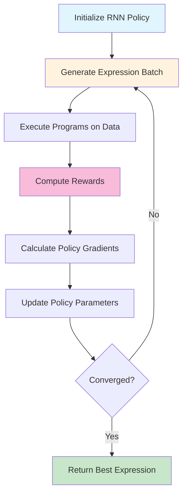

# Training & Evaluation

> Version: 1.0 • Last updated: 2025-09-01

This guide explains how DSO trains neural policies to discover mathematical expressions and evaluates their performance.

## 🎯 **Training Overview**

DSO uses reinforcement learning to train a neural network policy that learns to generate high-quality mathematical expressions.



### **Training Philosophy**
- **No Supervision**: No target expressions provided
- **Reward-Based Learning**: Policy learns from expression performance
- **Exploration vs Exploitation**: Balance trying new expressions vs refining good ones
- **Interpretable Results**: Focus on human-readable mathematical formulas

## 🧠 **Neural Policy Architecture**

### **RNN Policy Network**

The core of DSO is an RNN that generates mathematical expressions:

```python
class RNNPolicy:
    def __init__(self, library_size, hidden_size=256):
        self.embedding = nn.Embedding(library_size, hidden_size)
        self.rnn = nn.LSTM(hidden_size, hidden_size, num_layers=2)
        self.output = nn.Linear(hidden_size, library_size)
    
    def forward(self, tokens, hidden_state):
        # Embed tokens to vectors
        embedded = self.embedding(tokens)
        
        # Process through RNN
        output, hidden_state = self.rnn(embedded, hidden_state)
        
        # Generate token probabilities
        logits = self.output(output)
        probabilities = F.softmax(logits, dim=-1)
        
        return probabilities, hidden_state
```

### **Input/Output Structure**

```python
# Input: Current partial expression state
# - Previous tokens in expression
# - Current tree depth and structure
# - Available token constraints

# Output: Probability distribution over next token
# - High probability for good next tokens
# - Zero probability for invalid tokens
```

## 🔄 **Training Algorithm: REINFORCE**

DSO uses the REINFORCE policy gradient algorithm:

### **Training Loop**

```python
def training_step():
    # 1. SAMPLE: Generate batch of expressions
    batch_expressions = []
    batch_log_probs = []
    
    for _ in range(batch_size):
        expression, log_probs = policy.sample()
        batch_expressions.append(expression)
        batch_log_probs.append(log_probs)
    
    # 2. EVALUATE: Compute rewards for each expression
    rewards = []
    for expression in batch_expressions:
        reward = task.reward_function(expression)
        rewards.append(reward)
    
    # 3. COMPUTE LOSS: Policy gradient loss
    loss = compute_policy_gradient_loss(batch_log_probs, rewards)
    
    # 4. UPDATE: Gradient descent step
    optimizer.zero_grad()
    loss.backward()
    optimizer.step()
```

### **Policy Gradient Mathematics**

```python
# REINFORCE objective
J(θ) = E[R(τ) * ∇log π_θ(τ)]

where:
- θ = policy network parameters
- τ = expression trajectory (token sequence)  
- R(τ) = reward for expression τ
- π_θ(τ) = probability of generating τ under policy θ
```

### **Risk-Seeking Policy Gradient**

DSO uses a risk-seeking variant that focuses on finding the best expressions:

```python
def risk_seeking_loss(log_probs, rewards, epsilon=0.05):
    """
    Risk-seeking policy gradient with entropy regularization
    
    Args:
        log_probs: Log probabilities of generated tokens
        rewards: Rewards for each expression
        epsilon: Risk-seeking parameter (0 = risk-neutral, >0 = risk-seeking)
    """
    # Risk-seeking transformation
    risk_seeking_rewards = rewards + epsilon * (rewards - rewards.mean())**2
    
    # Policy gradient loss
    loss = -(log_probs * risk_seeking_rewards).mean()
    
    return loss
```

## 🏆 **Reward Functions & Metrics**

### **Regression Metrics**

#### **Inverse Normalized Root Mean Square Error (inv_nrmse)**
```python
def inv_nrmse(y_true, y_pred):
    """
    Primary metric - higher is better
    Range: [0, 1], where 1 = perfect fit
    """
    nrmse = np.sqrt(np.mean((y_true - y_pred)**2)) / np.std(y_true)
    return 1 / (1 + nrmse)
```

#### **Negative Mean Squared Error (neg_mse)**
```python
def neg_mse(y_true, y_pred):
    """
    Range: (-∞, 0], where 0 = perfect fit
    """
    return -np.mean((y_true - y_pred)**2)
```

#### **Pearson Correlation**
```python
def pearson(y_true, y_pred):
    """
    Range: [-1, 1], where 1 = perfect positive correlation
    """
    return scipy.stats.pearsonr(y_true, y_pred)[0]
```

### **Reward Function Implementation**

```python
def reward_function(program):
    # 1. Execute program on training data
    try:
        y_hat = program.execute(X_train)
    except:
        return invalid_reward  # Handle execution errors
    
    # 2. Check for invalid results (nan, inf)
    if program.invalid or np.any(~np.isfinite(y_hat)):
        return invalid_reward
    
    # 3. Optimize constants if present
    if program.const_pos:
        program.optimize_constants()
        y_hat = program.execute(X_train)
    
    # 4. Compute metric
    reward = metric(y_train, y_hat)
    
    # 5. Add noise for exploration (optional)
    if reward_noise > 0:
        reward += np.random.normal(0, reward_noise)
    
    return reward
```

## 📊 **Evaluation & Testing**

### **Training vs Test Evaluation**

```python
class RegressionTask:
    def reward_function(self, program):
        """Used during training - on training data"""
        y_hat = program.execute(self.X_train)
        return self.metric(self.y_train, y_hat)
    
    def evaluate(self, program):
        """Used for final evaluation - on test data"""
        y_hat = program.execute(self.X_test)
        
        # Multiple test metrics
        info = {
            "nmse_test": np.mean((self.y_test - y_hat)**2) / np.var(self.y_test),
            "success": nmse_test < self.threshold,
            "complexity": program.complexity
        }
        
        return info
```

### **Success Criteria**

```python
# Success typically defined as very low error on noiseless test data
success = nmse_test_noiseless < 1e-12

# This indicates the expression has essentially "solved" the problem
```

## 🎛️ **Training Configuration**

### **Key Hyperparameters**

```json
{
  "training": {
    "n_samples": 10000,        // Total expressions to generate
    "batch_size": 500,         // Expressions per training batch
    "epsilon": 0.05,           // Risk-seeking parameter
    "learning_rate": 0.001,    // Policy network learning rate
    "entropy_weight": 0.005    // Exploration bonus
  },
  
  "policy": {
    "max_length": 30,          // Maximum tokens per expression
    "num_layers": 2,           // RNN layers
    "hidden_size": 256         // Hidden state size
  }
}
```

### **Training Process Flow**

```python
def train():
    for iteration in range(n_samples // batch_size):
        # Sample batch of expressions
        batch = policy.sample(batch_size)
        
        # Evaluate expressions
        rewards = [task.reward_function(expr) for expr in batch]
        
        # Update policy
        loss = compute_loss(batch, rewards)
        optimizer.step(loss)
        
        # Track statistics
        log_training_stats(batch, rewards)
        
        # Save best expressions
        update_hall_of_fame(batch, rewards)
```

## 📈 **Training Monitoring**

### **Key Metrics to Track**

```python
training_stats = {
    "mean_reward": np.mean(rewards),           # Average performance
    "max_reward": np.max(rewards),             # Best expression found
    "success_rate": np.mean(success_flags),    # Fraction solving problem
    "mean_length": np.mean(expression_lengths), # Expression complexity
    "entropy": compute_entropy(token_probs),   # Policy exploration level
    "hall_of_fame_size": len(best_expressions) # Unique good solutions
}
```

### **Convergence Indicators**

```python
# Training has converged when:
# 1. Mean reward stabilizes
# 2. Success rate reaches desired level  
# 3. No new good expressions found recently
# 4. Policy entropy decreases (less exploration needed)
```

## 🔧 **Advanced Training Features**

### **Priority Queue Training (PQT)**

Focuses training on most promising expressions:

```python
class PriorityQueueTrainer:
    def __init__(self, k=10, batch_size=500):
        self.priority_queue = []  # Top-k best expressions
        self.k = k
        self.batch_size = batch_size
    
    def train_step(self):
        # Sample mostly from priority queue
        pqt_samples = sample_from_queue(self.priority_queue, self.batch_size * 0.8)
        new_samples = policy.sample(self.batch_size * 0.2)
        
        batch = pqt_samples + new_samples
        # ... rest of training
```

### **Curriculum Learning**

Gradually increase problem difficulty:

```python
# Start with simple function sets
function_sets = [
    ["add", "sub", "mul"],              # Level 1: Basic arithmetic
    ["add", "sub", "mul", "div"],       # Level 2: Add division  
    ["add", "sub", "mul", "div", "sin"] # Level 3: Add trigonometry
]

# Progress through levels based on success rate
if success_rate > 0.8:
    advance_to_next_level()
```

### **Multi-Task Training**

Train on multiple related problems simultaneously:

```python
tasks = [
    RegressionTask("Nguyen-1"),  # x^3 + x^2 + x
    RegressionTask("Nguyen-2"),  # x^4 + x^3 + x^2 + x  
    RegressionTask("Nguyen-3")   # x^5 + x^4 + x^3 + x^2 + x
]

# Randomly sample task for each expression
for iteration in training_loop:
    task = random.choice(tasks)
    batch = policy.sample(batch_size)
    rewards = [task.reward_function(expr) for expr in batch]
    # ... update policy
```

## 🎯 **Training Best Practices**

### **Hyperparameter Guidelines**

```python
# Batch size: Larger = more stable gradients, slower iteration
batch_size = 500  # Good default for most problems

# Learning rate: Too high = instability, too low = slow convergence  
learning_rate = 0.001  # Conservative starting point

# Risk-seeking: Higher = focus on best expressions
epsilon = 0.05  # Modest risk-seeking

# Max length: Longer = more complex expressions possible
max_length = 30  # Balance complexity vs efficiency
```

### **Common Training Issues**

```python
# Issue: Policy collapse (generates same expressions)
# Solution: Increase entropy weight, reduce learning rate

# Issue: No improvement after many iterations
# Solution: Check reward function, increase exploration

# Issue: Expressions too complex
# Solution: Add complexity penalty to reward function

# Issue: Training instability
# Solution: Reduce learning rate, increase batch size
```

This training framework enables DSO to efficiently discover high-quality mathematical expressions through principled reinforcement learning techniques.
