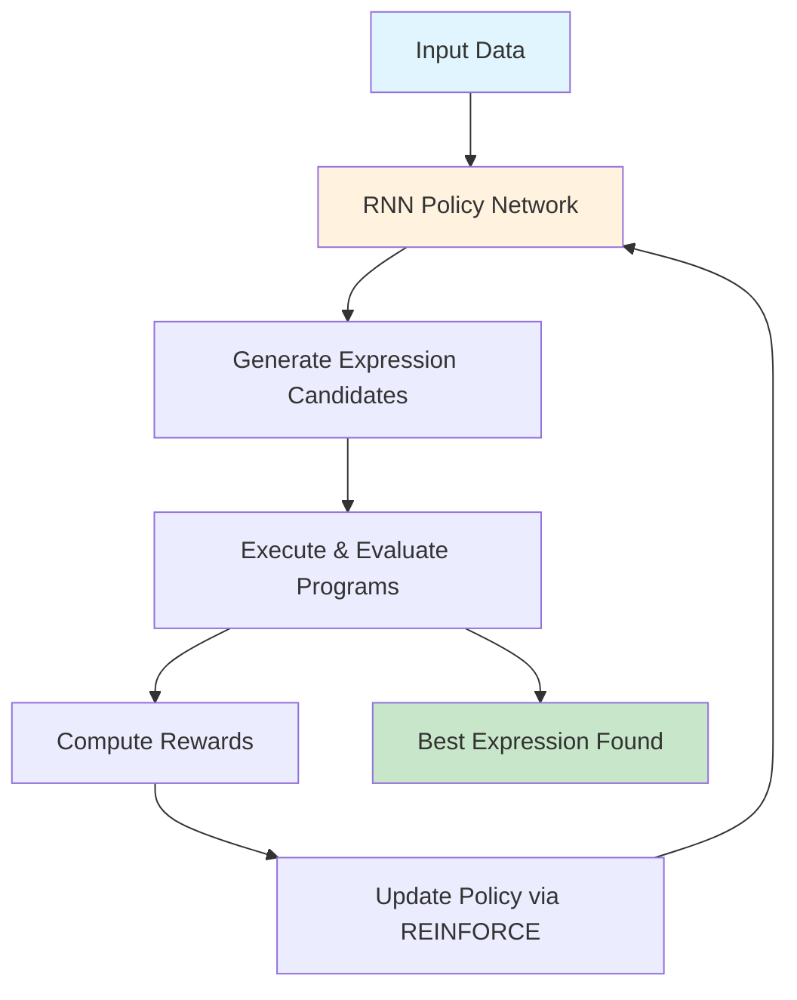
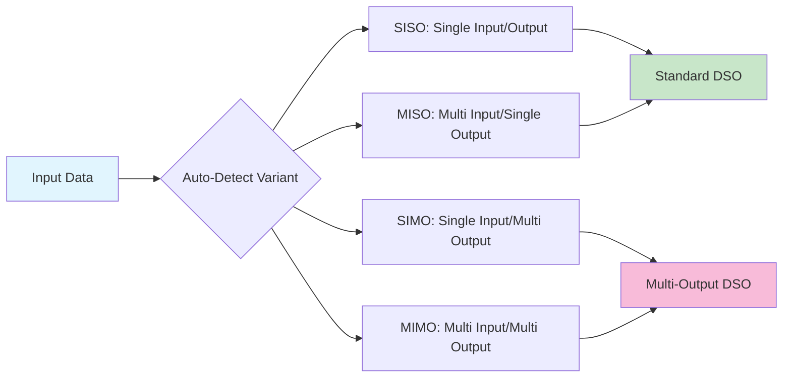

# Deep Symbolic Optimization (DSO)

<p align="center">
    
</p>

## Overview

**Deep Symbolic Optimization (DSO)** is a state-of-the-art framework that combines deep reinforcement learning with symbolic regression to automatically discover interpretable mathematical expressions from data. Unlike traditional machine learning approaches that produce black-box models, DSO generates human-readable mathematical formulas that scientists and engineers can understand, verify, and apply.

## Key Features

### 🧠 **AI-Driven Discovery**
DSO uses neural networks to intelligently search the space of mathematical expressions, learning to generate formulas that best fit your data.

### 📊 **Multi-Output Support** 
Complete support for MIMO (Multiple Input Multiple Output) regression with automatic data variant detection for SISO, MISO, SIMO, and MIMO problems.

### 🔍 **Interpretable Results**
Get explicit mathematical equations instead of black-box models - perfect for scientific research and engineering applications.

### 🏆 **Proven Performance**
- **1st place** in the 2022 SRBench Symbolic Regression Competition
- Published in top AI conferences (ICLR, ICML, NeurIPS)
- State-of-the-art accuracy on benchmark datasets

### ⚡ **Production Ready**
- GPU acceleration for fast training
- Parallel processing support
- Comprehensive testing and validation
- Well-documented APIs

## How DSO Works

DSO employs a sophisticated reinforcement learning process to discover mathematical expressions:



### 1. **Expression Generation**
A neural network (RNN policy) generates candidate mathematical expressions as sequences of tokens (operators, variables, constants).

### 2. **Expression Evaluation** 
Each generated expression is executed on your training data to compute a fitness score based on accuracy and complexity.

### 3. **Reinforcement Learning**
The neural network learns from the fitness scores using the REINFORCE algorithm, gradually improving its ability to generate better expressions.

### 4. **Iterative Refinement**
This process repeats for thousands of iterations until optimal mathematical formulas are discovered.

## Data Variant Support

DSO now supports multiple data variants with automatic detection:



## Applications

### 🔍 **Symbolic Regression**
Discover the underlying mathematical relationships in your data:
- **Physics**: Find governing equations from experimental data
- **Engineering**: Derive design equations from simulation results  
- **Finance**: Identify market relationships and trading formulas

**Example**: Given data points from a pendulum, DSO might discover: `ω = √(g/L)`

### 🎮 **Control Systems**
Create interpretable control policies for autonomous systems:
- **Robotics**: Generate readable control laws instead of black-box neural networks
- **Aerospace**: Develop flight control algorithms with mathematical guarantees
- **Manufacturing**: Design process control equations for industrial systems

**Example**: For a robotic arm, DSO might find: `τ = Kₚ(θ_target - θ) + Kᵈ(ω_target - ω)`

### 🧪 **Scientific Discovery**
Accelerate research by automatically finding mathematical laws:
- **Chemistry**: Discover reaction rate equations from experimental data
- **Biology**: Find population dynamics equations from observation data
- **Materials Science**: Derive property-structure relationships

## Why Choose DSO?

### ✅ **Transparency & Trust**
Unlike black-box models, DSO provides mathematical expressions that can be:
- **Verified** by domain experts
- **Analyzed** for physical consistency  
- **Validated** against known laws
- **Interpreted** with confidence

### ⚡ **High Performance**
- **GPU acceleration** for fast training and evaluation
- **Parallel processing** for handling large datasets
- **Optimized algorithms** for efficient expression search
- **Scalable architecture** for complex problems

### 🔧 **Flexibility & Extensibility**
- **Custom operators**: Add domain-specific mathematical functions
- **Configurable constraints**: Incorporate prior knowledge and physical laws
- **Multiple architectures**: RNN, Transformer, and custom policy networks
- **Extensible framework**: Easy integration with existing workflows

### 🎯 **Research-Grade Quality**
- **Rigorous testing**: Comprehensive test suite ensuring reliability
- **Peer-reviewed**: Published methods in top-tier venues
- **Active development**: Continuous improvements and new features
- **Community support**: Growing ecosystem of users and contributors

## Quick Start

Get started with DSO in just three commands:

```bash
# 1. Clone and setup
git clone https://github.com/your-org/dso.git && cd dso
./main.sh  # Press '1' when prompted

# 2. Activate environment  
source .venv/bin/activate

# 3. Run your first experiment
python -m dso.run dso/config/config_regression.json --b Nguyen-7

or use 

./main.sh  # Press '3' when prompted
```

## Simple Example

Here's how to use DSO to discover a mathematical formula:

```python
from dso import DeepSymbolicRegressor
import numpy as np

# Generate training data from a known function
X = np.random.random((100, 2))
y = np.sin(X[:,0]) + X[:,1] ** 2  # True formula: sin(x₀) + x₁²

# Train DSO to discover the formula
model = DeepSymbolicRegressor(
    function_set=["add", "mul", "sin", "pow"],
    max_complexity=20
)
model.fit(X, y)

# View the discovered expression
print("Discovered formula:", model.program_.pretty())
# Output: "sin(x0) + x1^2"

# Use for prediction
y_pred = model.predict(X_test)
```

## Documentation Structure

This documentation is organized into four main sections:

### 📚 **Getting Started**
- **[Quick Start Guide](core/getting_started)** - Run your first DSO experiment
- **[Installation & Setup](core/setup)** - Detailed setup instructions and troubleshooting

### 🧠 **Core Concepts** 
- **[Fundamental Concepts](core/concept)** - Understanding symbolic regression and reinforcement learning
- **[System Architecture](core/architecture)** - How DSO components work together
- **[Token System](core/tokens)** - Mathematical building blocks and operators
- **[Training Process](core/training)** - Neural network training and optimization
- **[Constraints & Priors](core/constraints)** - Incorporating domain knowledge

### 🚀 **Advanced Topics**
- **[MIMO Extensions](core/mimo)** - Multiple output regression capabilities  
- **[Advanced Features](core/advanced)** - Multi-task learning, custom operators, and ensemble methods

### 📋 **Development Guidelines**
- **Rules** - Coding standards, git workflow, and contribution guidelines
- **Structure** - Project organization and testing protocols

## Next Steps

Ready to get started? We recommend following this learning path:

1. **Begin with** [Getting Started](core/getting_started) to run your first experiment
2. **Understand** [Core Concepts](core/concept) to grasp the fundamentals  
3. **Explore** [System Architecture](core/architecture) for deeper technical understanding
4. **Experiment** with [Advanced Features](core/advanced) for specialized applications

---

*DSO is developed by researchers at Lawrence Livermore National Laboratory and has been published in top-tier AI conferences including ICLR, ICML, and NeurIPS.*
